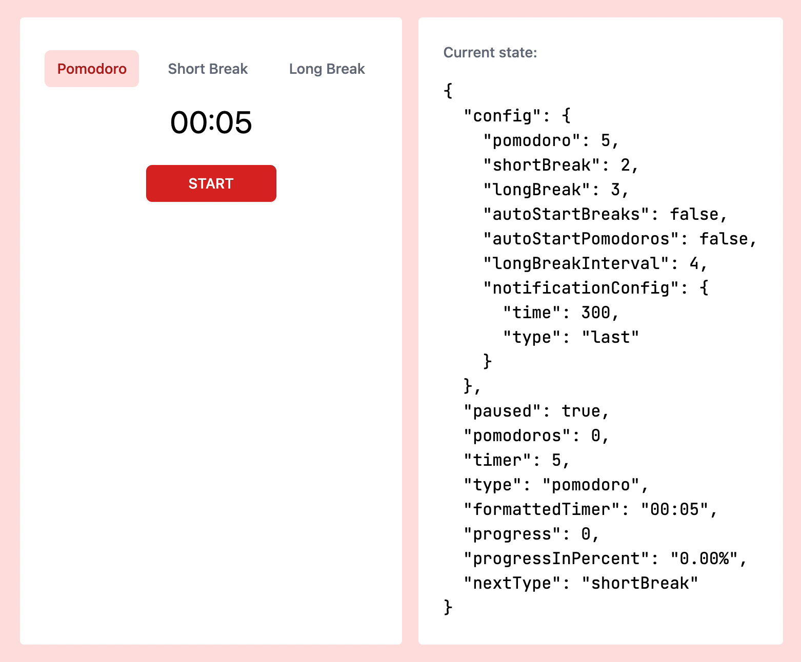

# use-pomodoro 🍅

> Use pomodoro logic wrapped in a react hook / no extra dependencies

[](https://www.npmjs.com/package/use-pomodoro) [](https://standardjs.com)

## What is pomodoro technique?

> The Pomodoro Technique is a time management method developed by Francesco Cirillo in the late 1980s. It uses a timer to break work into intervals, typically 25 minutes in length, separated by short breaks. Each interval is known as a pomodoro, from the Italian word for tomato, after the tomato-shaped kitchen timer Cirillo used as a university student.

> The technique has been widely popularized by apps and websites providing timers and instructions. Closely related to concepts such as timeboxing and iterative and incremental development used in software design, the method has been adopted in pair programming contexts.

[More about this technique](https://francescocirillo.com/pages/pomodoro-technique)

## Install

```bash
npm install --save use-pomodoro
```

## Basic Usage

This is a basic usage of `usePomodoro` hook and it's abilities.

```tsx
import { usePomodoro } from "use-pomodoro";

const Example = () => {
  const {
    state,
    dispatch,
    start,
    stop,
    reset,
    goPomodoro,
    goShortBreak,
    goLongBreak,
    changeConfig,
    formattedTimer,
  } = usePomodoro();
  return <div>{formattedTime}</div>; // should render 25:00
};
```

## Context usage

If you need pomodoro timer sync within multiple components, then you can use Context API prepared for that.

```tsx
import { PomodoroProvider } from "use-pomodoro";

// Example.tsx
const Example = () => {
  return (
    <PomodoroProvider>
      <Navbar />
      <App />
      <Footer />
    </PomodoroProvider>
  )
};

// Navbar.tsx
import { usePomodoroContext } from "use-pomodoro";
const Navbar = () => {
  const { state, start, ...rest } = usePomodoroContext();
}

// Footer.tsx
import { usePomodoroContext } from "use-pomodoro";
const Footer = () => {
  const { formattedTimer, start, stop ...rest } = usePomodoroContext();
}
```

---

## Return API of `usePomodoro` and `usePomodoroContext` hooks

- `state: PomodoroState`: current state of the pomodoro
- `dispatch: (action: PomodoroAction) => void`: dispatch action to change the state
- `start: () => void`: start the timer
- `stop: () => void`: stop the timer
- `reset: () => void`: reset the timer
- `goPomodoro: () => void`: go to pomodoro state
- `goShortBreak: () => void`: go to short break state
- `goLongBreak: () => void`: go to long break state
- `changeConfig: (config: Partial<PomodoroConfig>) => void`: change the config
- `formattedTimer: string`: formatted time (e.g. `25:00`)

## Types

```ts
// every - repeating time of notification
// last - send one notification x seconds before timer ends
type NotificationType = "last" | "every";

type NotificationConfig = {
  type: NotificationType; // default: "last"
  time: number; // time in seconds, default: 5 minutes
};

type PomodoroConfig = {
  pomodoro: number; // pomodoro time in seconds (default: 25 minutes)
  shortBreak: number; // short break time in seconds (default: 5 minutes)
  longBreak: number; // long break time in seconds (default: 15 minutes)
  autoStartBreaks: boolean; // start short and long breaks automatically after work time (default: false)
  autoStartPomodoros: boolean; // start pomodoros automatically after breaks (default: false)
  longBreakInterval: number; // long break interval in pomodoros (default: 4)
  notificationConfig: NotificationConfig; // notification config
};

// current timer type (pomodoro, short break, long break)
type PomodoroType = "pomodoro" | "shortBreak" | "longBreak";

// pomodoro state (usage and configuration values)
type PomodoroState = {
  type: PomodoroType; // current timer type (default: "pomodoro")
  timer: number; // current timer value (default: 25 minutes)
  paused: boolean; // timer is paused (default: true)
  config: PomodoroConfig; // pomodoro configuration
};
```

---

## Development

Local development is broken into two parts (ideally using two tabs).

First, run rollup to watch your `src/` module and automatically recompile it into `dist/` whenever you make changes.

```bash
npm start # runs rollup with watch flag
```

The second part will be running the `example/` create-react-app that's linked to the local version of your module.

```bash
# (in another tab)
cd example
npm start # runs create-react-app dev server
```

Now, anytime you make a change to your library in `src/` or to the example app's `example/src`, `create-react-app` will live-reload your local dev server so you can iterate on your component in real-time.

## TODO

- [x] create example app
- [x] add progress value for current timer
- [x] add toggle timer function
- [x] add pomodoros counter
- [x] add skip forward to next timer type
- [x] add nextType value
- [ ] write down list of features
- [ ] add tests

## License

MIT © [kacgrzes](https://github.com/kacgrzes)

---

This hook is created using [create-react-hook](https://github.com/hermanya/create-react-hook).
